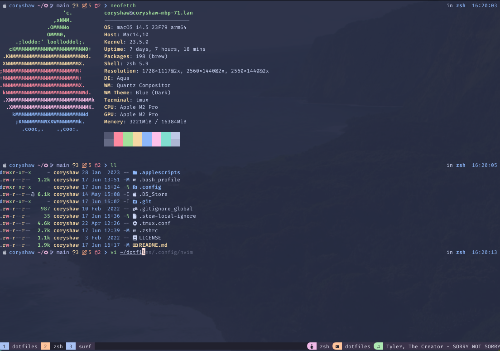
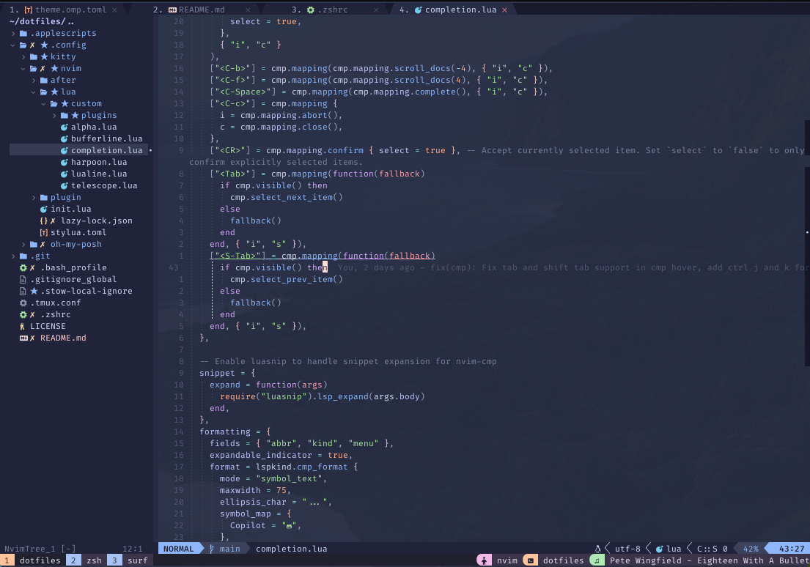
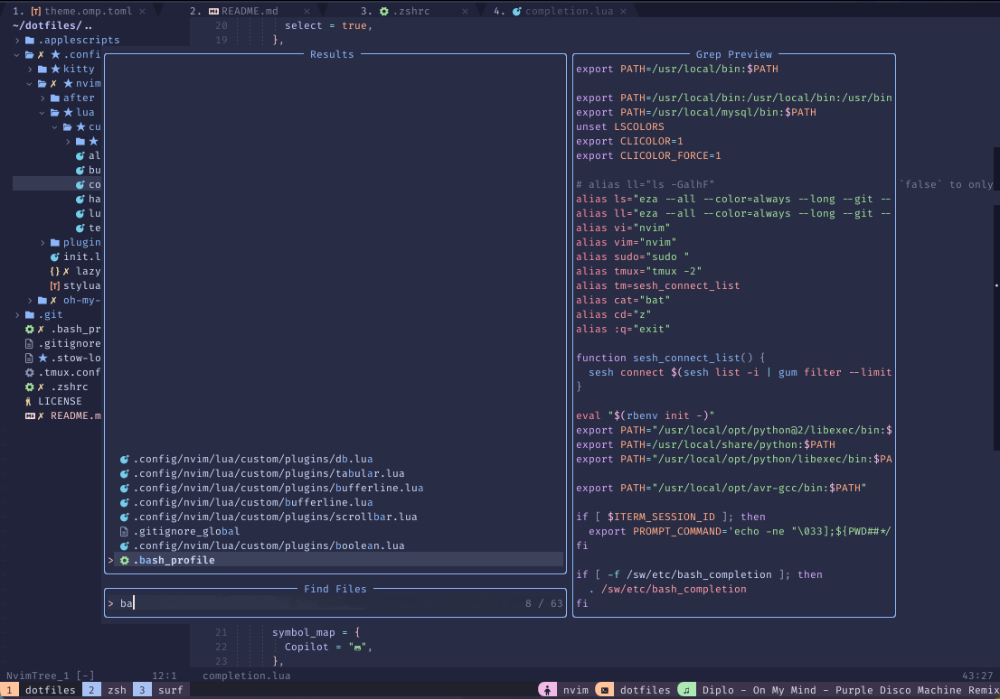

## Dotfiles
This repository includes all of my custom dotfiles.  They should be cloned to
somewhere that doesn't clone the files directly to your home `~` directory. For example it's best to clone to a directory like `~/dotfiles`.

Once the files are cloned, we will use GNU Stow to create symlinks from the cloned directory to the home directory. This allows all config locations to be correct based on the symlinks.

## Screenshots




### Theme
[Catppuccin Macchiato](https://github.com/catppuccin/catppuccin)

### Font
[Fira Code Nerd Font](https://github.com/ryanoasis/nerd-fonts/tree/master/patched-fonts/FiraCode)

### Config Included
* [Neovim](https://github.com/neovim/neovim)
* [Tmux](https://github.com/tmux/tmux)
* [Kitty](https://github.com/kovidgoyal/kitty)
* [oh-my-posh](https://github.com/JanDeDobbeleer/oh-my-posh)

## Installation
```bash
git clone https://github.com/coryshaw1/dotfiles ~/dotfiles
cd ~/dotfiles
stow .
```

This will get you up and running, but there are various other things that need to be installed on top of the dotfiles. First off, you will need a package manager. For macOS, I always use [Homebrew](https://brew.sh/), but for Linux, the package manager may be dependent on your distro. Windows users can use [Chocolatey](https://chocolatey.org/).

#### Other packages to install via package manager
* [zsh](https://git.code.sf.net/p/zsh/code)
* [zsh-autosuggestions](https://github.com/zsh-users/zsh-autosuggestions)
* [zsh-syntax-highlighting](https://github.com/zsh-users/zsh-syntax-highlighting)
* [fzf](https://github.com/junegunn/fzf)
* [fzf-git](https://github.com/junegunn/fzf-git.sh)
* [zoxide](https://github.com/ajeetdsouza/zoxide) - Better cd
* [eza](https://github.com/eza-community/eza) - Better ls
* [bat](https://github.com/sharkdp/bat) - Better cat with syntax highlighting
* [sesh](https://github.com/joshmedeski/sesh) - Easy session manager
